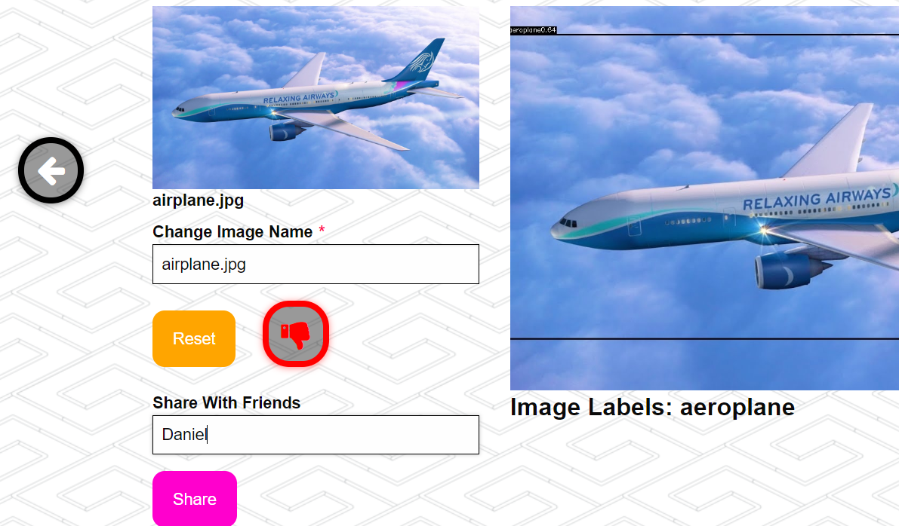
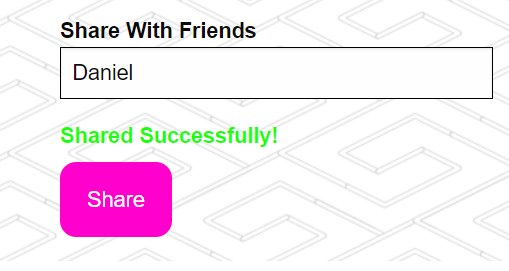
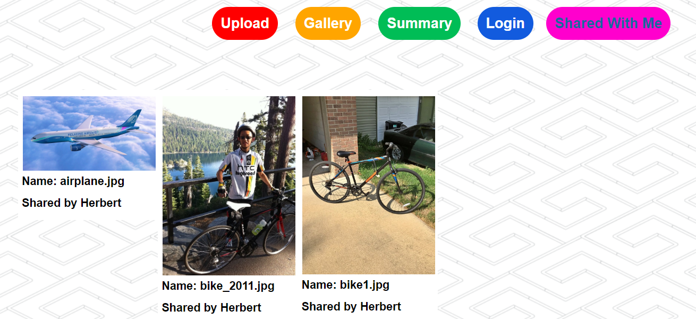
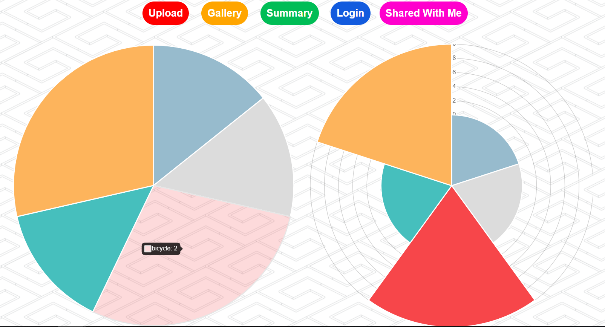
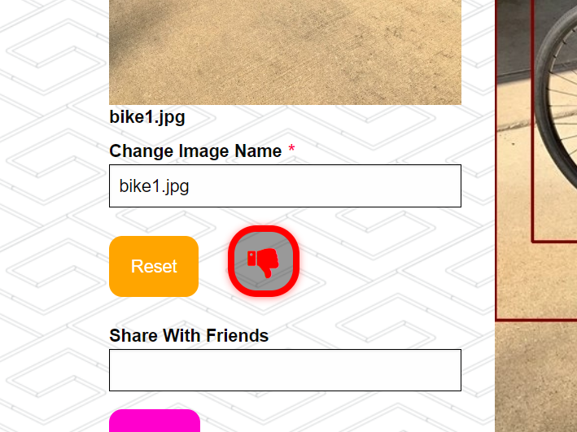
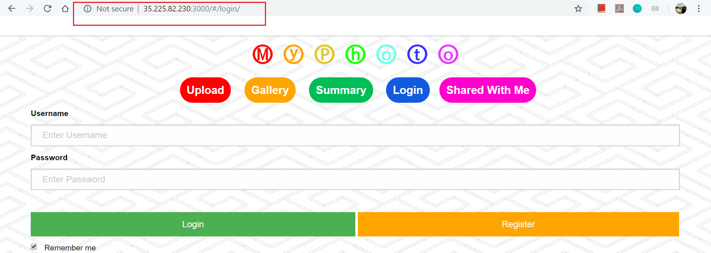

# fa18-cs242-final

# Week 4 Goals:
#### 1. Add sharing functionality so that user can share his/her images with other registered users:
* Status: \<Completed> I implemented sharing function where user can go to the detail page of upload images and enter the user ID that she wants to share with. Once the image is shared, the receiving end is able to view the shared images under "Shared with me" tab.  

#### 2. Add summary of images using visualization:
* Status: \<Completed> I added visualization that summarize the categories of all images in user's gallery. User can now click on "summary" tab and it shows user a summary of all image labels in her gallery. User can drag the mouse to hover the pie chart to see the quantity of each labels.

#### 3. Add dislike button that allows user to dispose unfavorite image:
* Status: \<Completed> I added addition function and API call that allow user to not only just upload images, but also can later delete unfavorite images from her gallery.
	
#### 4. On to the cloud: 
* Status: \<Completed> I hosted the application on Google cloud service so that the application no longer just run on local host, but also on remote server.

      
# Week 4 Manual Testing:
### Share function and "share with me" page:
* If user want to share images with his friends, first login and go to the detail page of the image that he wants to share.:
	
* User can enter the user ID of the user he wants to share and click the share button. If the image is shared successfully, it will prompt the user "Shared Successfully!":
	
* For example, Herbert shared 3 images to Daniel, Daniel can click the "Shared with me" tab on the top to direct to share page and view the shared images. Each image has its name and the name of the person who shares the images with:
	

### Summary Page:
* When user click on the summary tab on top of the page, it will direct user to the summary page. The summary page summarizes labels for all images in gallery:
* User can drag mouse on top of the pie chart to see quantity of a label appears in gallery:
	

### Delete Images:
* If user dislike any previously uploaded image, she can delete the image from her gallery by clicking the thumb down button. By clicking, it will delete the image in back-end database and user will no longer be able to view the deleted image:  
	
    
### On the cloud:
* The application is hosted on remote server so that any user can access the [application](http://35.225.82.230:3000). ```* I turned the instance off to save quotas from Google Cloud, if you would like to test/play with the application, please send me an email at rwang67@illinois.edu and I will turn the instance on:  ```
	

# To Test:
###### To test all API calls and image detection library:
```python
python test.py
```    
    
# To install
###### It is recommanded to create a virtual environment first: 
* To create virenv:
```bash
virtualenv venv
source venv/bin/activate
```
* Then install requirement:
```bash
pip install -r requirements.txt
```

# To Run:
1. To run the backend:
```python
python server.py
```
2. To run the frontend angularjs app:
```bash
npm install (remember to use --no-bin-links if you're on Windows)
bower install
grunt --force
```
3. You can leave this command running in the background while development for livereloading:
```bash
grunt --force
```
